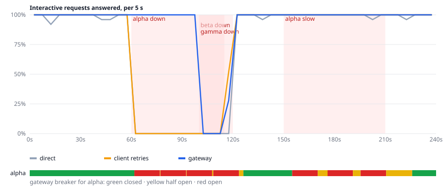
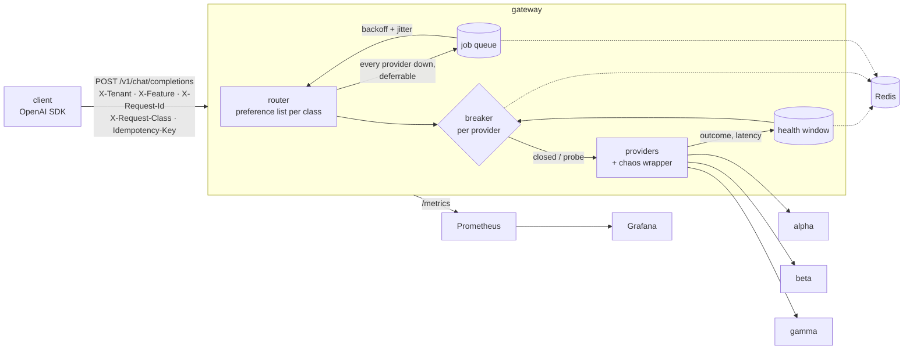

# llm-gateway

[](https://github.com/umer-78/umer-78-llm-gateway/actions/workflows/ci.yml)

**A self-healing LLM gateway that kept 92.2% of interactive requests answered through
four minutes of scripted provider outages, against 74.4% when calling one provider
directly, finished 100% of deferrable work, and attributed every dollar to a tenant and a
feature.**

One OpenAI-compatible endpoint in front of several model providers. Each provider gets a
circuit breaker fed by a rolling health window in Redis; open breakers are skipped, half-open
ones are probed with a small share of traffic until they recover on their own. Latency-sensitive
requests are hedged, deferrable ones are queued through an outage, and a chaos endpoint breaks
providers on demand so all of it can be watched on a Grafana board.

## Result

The same 1,440 requests (5/s interactive, 1/s batch, two tenants, three features) sent through
three setups while providers fail on a schedule: `alpha` returns 503s from 60 to 120 s, every
provider is down from 100 to 115 s, and `alpha` answers 6 s slower from 150 to 210 s.

| Setup | Interactive answered | p50 | p95 | Batch completed | Spend |
|---|---:|---:|---:|---:|---:|
| Call one provider directly | **74.4%** | 1.11 s | 7.25 s | 93.3% | $1.70 |
| Client-side retries (3, same provider) | **76.1%** | 1.13 s | 7.24 s | 94.6% | $1.74 |
| **This gateway** | **92.2%** | 0.96 s | 2.01 s | 100.0% | $1.82 |



When alpha started failing at 60 s its breaker opened **1.8 s** later; when it recovered at 120 s the half-open probes closed it again **6.2 s** later, with no one touching it. When alpha turned slow at 150 s the breaker opened on latency after **5.0 s**, and traffic moved to beta.

Reproduce it with `python -m bench.chaos` (about four minutes, needs Redis) or
`python -m bench.chaos --fake-redis`. The providers are simulated: the numbers measure the
gateway's recovery logic, not any model's quality or any vendor's real uptime. Raw output is in
[`docs/bench-v2.txt`](docs/bench-v2.txt) and [`docs/bench-v2.json`](docs/bench-v2.json).

**What it costs.** The gateway spent $1.82 against $1.70 for the direct call (+7%): failover sends some traffic to a pricier provider, and 34 hedged requests paid for a second call that lost (3% of spend). By tenant: acme $1.29, globex $0.53; by feature: chat $0.92, search $0.88, summarize $0.02.

## Architecture



- **Request classes** decide the failover order and behaviour. `interactive` tries alpha, beta,
  gamma and races a second provider after 2.5 s; `classify` prefers the cheap model; `batch`
  is deferrable and waits out an outage in the queue instead of failing.
- **Health** is a sorted set per provider in Redis: every call's outcome and latency inside the
  last 30 s, with error kinds kept apart (rate limit, timeout, server error, auth, content filter).
- **Breakers** open on five failures in a row, on an error rate of 50% or more over at least ten
  calls, or on a p95 above the provider's own latency budget. After 15 s they go half open, send
  10% of traffic as probes, and close after three probes succeed. Both health and breaker state
  live in Redis, so replicas agree and a restart forgets nothing.
- **Cost attribution**: every request must name its tenant, feature and request id, and every
  attempt's spend, including hedge legs that lost, is counted against them
  (`llm_gateway_cost_usd_total{tenant,feature,provider}`).
- **Per-tenant rate limiting** (off by default): each tenant gets a token bucket in Redis that
  refills at `rate_per_s` up to `burst`. A request with no token free is refused with a 429 and a
  `Retry-After`. The bucket is read-modify-written inside a WATCH transaction, so replicas sharing
  a limit cannot overspend. Set `per_feature: true` to meter each tenant+feature pair on its own.
  Configure it under `rate_limit:` in `config.yaml`.

## Design decisions

1. **Breakers and health in Redis, not in process memory.** It costs a few Redis round trips per
   call, and in exchange every replica sees the same provider state and a deploy does not reset a
   breaker that is open for a reason.
2. **Hedging only for the latency-sensitive class, and billed honestly.** A hedge fires a second
   provider after 2.5 s and cancels the loser. The cancelled leg is counted as if it had been
   billed in full, because a provider may bill a request the client stopped waiting for; the
   cost line above is that worst case.
3. **One OpenAI-compatible adapter instead of LiteLLM.** OpenAI, Groq, Ollama and vLLM all accept
   the same `/chat/completions` request, so a 40-line httpx adapter covers the three providers this
   needs. What it gives up is LiteLLM's handling of each vendor's quirks, which a larger provider
   list would want.

## What did not work

The first version ran the same benchmark and got 90.1% interactive availability, a p95 of 3.95 s and $2.36 of spend, 24% of it on hedge legs that lost. Three problems, all visible in
[`docs/bench-v1.txt`](docs/bench-v1.txt):

1. **A hard outage took 15 s to notice.** The only trip rule was "50% errors in the last 30 s",
   and the window still held about 150 healthy calls from before the outage, so it took 150
   failures to reach 50%. A run of five failures now opens the breaker on its own: the same outage now opens it in 1.8 s instead of 15.1 s.
2. **Hedging hid a slow provider from its breaker.** When alpha went 6 s slow, every call to it
   was hedged at 2.5 s and cancelled when beta answered, and a cancelled call recorded nothing.
   Alpha looked healthy for the whole minute, its breaker never opened, 300 requests paid for two
   calls, and cancelled legs were 25% of all spend. A cancelled leg now records the time it ran
   as a lower bound on its latency, and a cancelled probe counts as a failed one: the slow phase now opens alpha's breaker after 5.0 s, hedged requests fell from 300 to 34, and spend on lost hedges from 24% to 3%.
3. **One latency budget tripped a healthy model.** The small self-hosted model answers in about
   1.4 s with a p95 near 2.5 s. With a 3 s budget for everyone, and "p95" over a 30-second window
   at one request a second being the second-largest of about 30 samples, it crossed the budget by
   chance and was taken out of rotation at 59 s with nothing wrong. Budgets are now per provider.

4. **Concurrent requests raced the same transition.** Two failures landing together both saw
   five in a row and both opened the breaker, so the event (and its metric) fired twice.
   Transitions are now compare-and-set inside a Redis transaction: exactly one request makes each
   move, which also keeps several gateway replicas from fighting over it.

Also not done: streaming responses (the endpoint refuses `stream: true`), and a run against real
providers, which needs API keys. The first benchmark also ran at 20x time compression, where the
harness itself used enough CPU to add latency; it now runs at 4x, and v1 was re-measured at 4x
for the comparison above.

## Run it

```bash
docker compose --profile demo up -d          # gateway, Redis, Prometheus, Grafana + demo traffic
open http://localhost:3000                   # the "LLM gateway" dashboard
./scripts/demo.sh                            # break alpha, watch the trip, reroute and recovery
```

Call it like OpenAI, with three extra headers:

```bash
curl localhost:8000/v1/chat/completions \
  -H 'Content-Type: application/json' \
  -H 'X-Tenant: acme' -H 'X-Feature: chat' -H 'X-Request-Id: 42' \
  -d '{"messages": [{"role": "user", "content": "Where is my order?"}]}'
```

The response has the usual OpenAI shape plus a `gateway` block (provider, attempts, cost) and
`X-Gateway-Provider` / `X-Gateway-Cost-USD` headers. Other endpoints:

| Endpoint | |
|---|---|
| `GET /v1/jobs/{id}` | status and result of a deferred request (a 202 carries the id) |
| `GET /metrics` | Prometheus metrics |
| `GET /admin/providers` | breaker state, health window and chaos rule per provider |
| `GET /admin/events` | breaker transitions |
| `POST /admin/chaos/{provider}` | `{"error_rate": 1, "error_kind": "rate_limited", "extra_latency_ms": 0, "duration_s": 60}` |
| `DELETE /admin/chaos/{provider}` | clear it |

Admin endpoints need `Authorization: Bearer $GATEWAY_ADMIN_TOKEN` and are off when it is unset.
`Idempotency-Key` makes a retried call replay the first answer instead of paying twice. To use
real models, switch providers to `kind: openai_compat` in [`config.yaml`](config.yaml).

## Tests

```bash
pip install -e '.[dev]'
pytest -q                                     # breaker, health, router, queue and API tests
python -m bench.chaos --check                 # fails unless failover beats a direct call
```

CI runs both on every push, so the failover logic is re-proven each time, not asserted once.

## Licence

MIT
